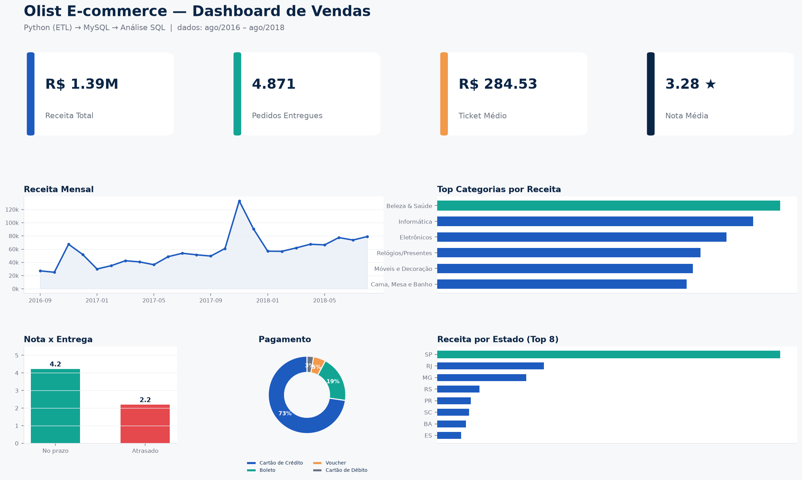
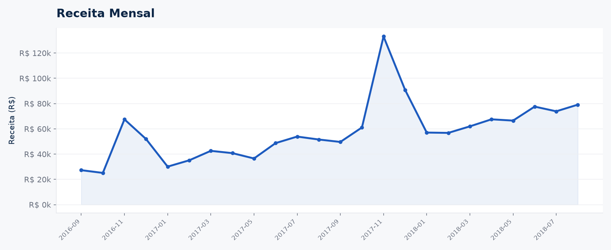
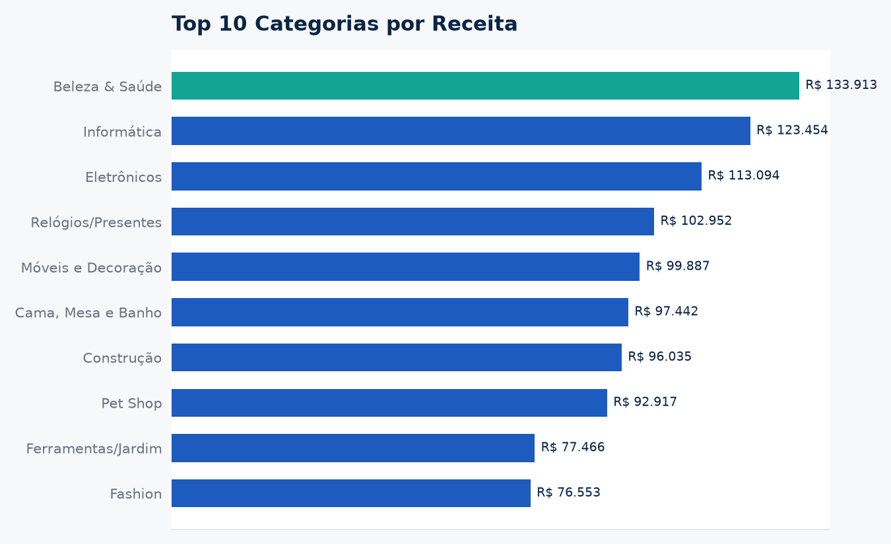
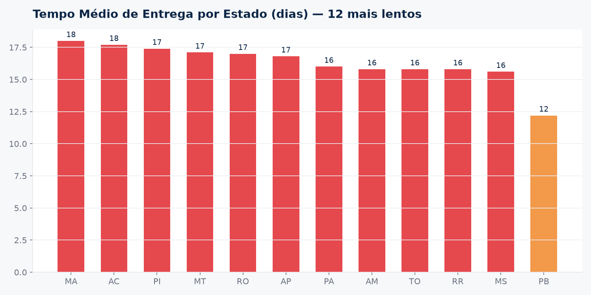
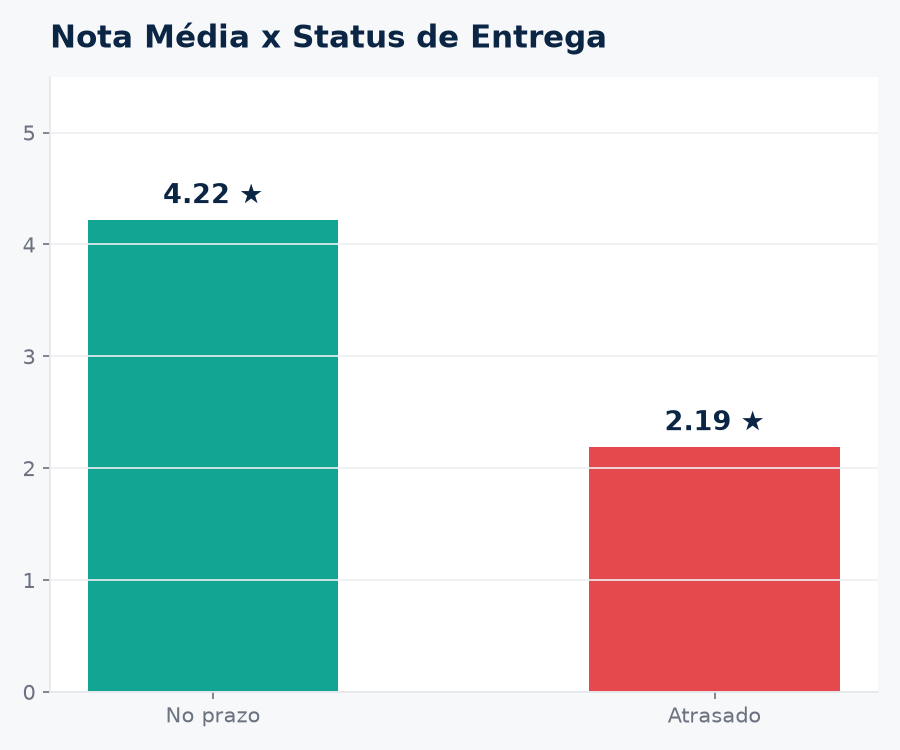
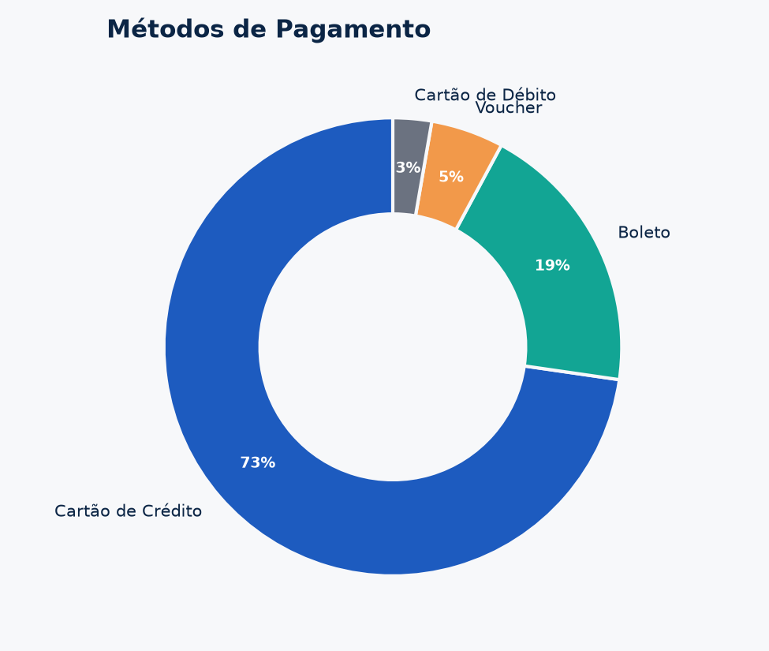
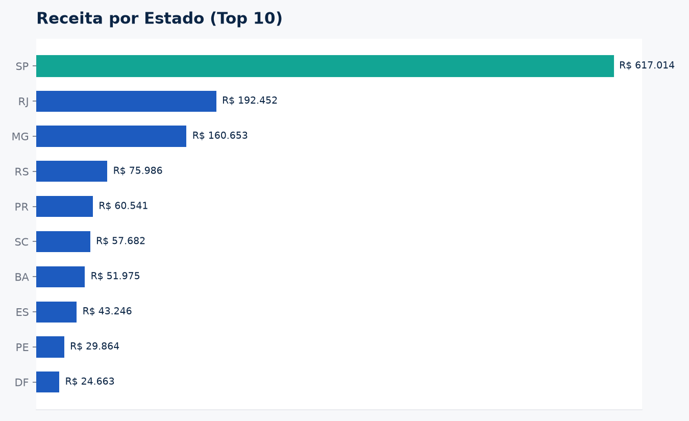

#  Análise de Dados de E-commerce — Olist

Pipeline completo de dados usando **Python (ETL) → MySQL → SQL de negócio → Dashboard de BI**,
construído sobre o formato do *Brazilian E-Commerce Public Dataset by Olist* (Kaggle).

O projeto cobre o ciclo inteiro: extração e limpeza de dados brutos, modelagem
relacional, carga em banco de dados, consultas analíticas e visualização em
dashboard — a mesma estrutura de um projeto real de Analista/Cientista de Dados
júnior.



>  **Sobre os dados usados nas imagens deste README:** este ambiente não
> tinha acesso ao Kaggle para baixar o dataset original, então os números e
> gráficos abaixo foram gerados a partir de um **dataset sintético** (mesma
> estrutura de colunas, mesmo tipo de "sujeira" — nulos, datas como texto,
> duplicatas — e os mesmos padrões de negócio do dataset real, como atraso de
> entrega afetando a nota de avaliação). O pipeline inteiro — schema, ETL e
> queries — já roda de ponta a ponta contra um MySQL de verdade. Para trocar
> pelos dados reais, veja a seção [Como reproduzir com os dados reais](#-como-reproduzir-com-os-dados-reais-do-kaggle).

---

##  Perguntas de negócio respondidas

- Qual a receita mensal e como ela evolui ao longo do tempo?
- Quais categorias de produto vendem mais?
- Qual o tempo médio de entrega e ele afeta a nota de avaliação do cliente?
- Quais estados compram mais?
- Quais são os métodos de pagamento mais usados?

##  Principais insights (rodados no dataset de exemplo)

- **Atraso na entrega derruba a satisfação:** pedidos entregues no prazo têm
  nota média **4.22**, contra **2.19** nos atrasados — a variável que mais
  impacta a avaliação do cliente não é o produto, é a logística.
- **Concentração geográfica:** SP sozinho responde por boa parte da receita
  total, seguido de RJ e MG — reflexo direto da distribuição populacional/
  econômica do Brasil.
- **Cartão de crédito domina:** ~73% dos pagamentos são no cartão de crédito,
  o que sugere espaço para políticas de parcelamento como alavanca comercial.
- **Sazonalidade de novembro:** o mês de novembro (Black Friday) mostra um
  pico bem acima da média histórica de receita.

---

##  Dashboard

| Receita Mensal | Top Categorias |
|---|---|
|  |  |

| Tempo de Entrega por Estado | Atraso x Nota de Avaliação |
|---|---|
|  |  |

| Métodos de Pagamento | Receita por Estado |
|---|---|
|  |  |

---

##  Stack

- **Python** (pandas, SQLAlchemy) — ETL
- **MySQL** — modelagem relacional e armazenamento
- **SQL** — consultas analíticas
- **Matplotlib** — visualização (dashboard também pode ser recriado em Power BI, ver seção abaixo)
- **Jupyter Notebook** — exploração inicial dos dados

##  Arquitetura do pipeline

```
Kaggle CSVs (data/raw/)
        │
        ▼
 ┌──────────────┐     Extract → Transform → Load
 │  src/etl.py  │────────────────────────────────►  MySQL (olist_ecommerce)
 └──────────────┘                                          │
                                                             ▼
                                                    sql/queries.sql
                                                             │
                                                             ▼
                                                   Dashboard de BI (imagens/Power BI)
```

Modelo relacional:

```
customers ──< orders ──< order_items >── products
                │                │
                │                └──< order_payments
                │
                └──< order_reviews

sellers ──< order_items
```

##  Estrutura do projeto

```
projeto-olist/
├── data/
│   ├── raw/                        # CSVs (baixe do Kaggle — ver .gitignore)
│   └── generate_sample_data.py     # gera dataset sintético de exemplo
├── sql/
│   ├── schema.sql                  # criação das tabelas
│   └── queries.sql                 # 7 consultas de negócio
├── src/
│   └── etl.py                      # pipeline Extract-Transform-Load
├── notebooks/
│   └── exploracao.ipynb            # exploração inicial (já executado)
├── analysis/
│   ├── run_queries.py              # roda as queries de negócio e exporta .tsv
│   └── build_dashboard_images.py   # gera as imagens do dashboard a partir dos .tsv
├── images/                         # gráficos do dashboard (usados neste README)
├── requirements.txt
└── README.md
```

---

##  Como rodar

### 1. Pré-requisitos
```bash
python -m venv venv
source venv/bin/activate      # Windows: venv\Scripts\activate
pip install -r requirements.txt
```
Tenha um servidor **MySQL** rodando localmente.

### 2. Criar o banco
```bash
mysql -u root -p < sql/schema.sql
```

### 3. Gerar os dados (ou baixar os reais — ver seção abaixo)
```bash
cd data && python generate_sample_data.py && cd ..
```

### 4. Rodar o ETL
```bash
export MYSQL_PASSWORD="sua_senha"     # Windows (PowerShell): $env:MYSQL_PASSWORD="sua_senha"
python src/etl.py
```

### 5. Rodar as consultas de negócio e exportar os resultados
```bash
python analysis/run_queries.py
```

### 6. Gerar as imagens do dashboard
```bash
cd analysis && python build_dashboard_images.py
```

---

## 📥 Como reproduzir com os dados reais do Kaggle

1. Baixe o dataset em
   [kaggle.com/datasets/olistbr/brazilian-ecommerce](https://www.kaggle.com/datasets/olistbr/brazilian-ecommerce)
2. Extraia os CSVs para `data/raw/`, substituindo os arquivos sintéticos
3. Rode o pipeline normalmente a partir do passo 4 acima — as colunas têm
   exatamente os mesmos nomes do dataset real, então nada mais precisa mudar

## 📊 Dashboard em Power BI (opcional)

As imagens deste README foram geradas com Python/Matplotlib direto a partir
dos resultados do MySQL, para que o projeto funcionasse de ponta a ponta neste
ambiente sem depender de uma instalação gráfica do Power BI. Se você quiser
montar a versão interativa em **Power BI Desktop** (mais comum em vagas de
estágio no Brasil):

1. Baixe o [Power BI Desktop](https://powerbi.microsoft.com/pt-br/desktop/) (gratuito, Windows)
2. `Obter dados` → `Banco de Dados` → `MySQL database` → informe `localhost` e `olist_ecommerce`
3. Importe as tabelas `orders`, `customers`, `order_items`, `products`, `order_payments`, `order_reviews`
4. Confira/crie os relacionamentos na aba **Modelagem**
5. Recrie os visuais usando `sql/queries.sql` como referência: cartões de KPI,
   linha (receita mensal), barras (categorias, estados), mapa (pedidos por
   estado) e pizza (pagamento)

---

##  Como apresentar isso numa entrevista

- **"Me conta sobre esse projeto"** → pipeline ETL em Python que carrega dados
  de e-commerce num MySQL modelado relacionalmente, com consultas SQL que
  respondem perguntas de negócio, visualizadas num dashboard.
- **"Por que MySQL e não só CSV?"** → os dados são relacionais (pedidos,
  clientes, produtos, vendedores se conectam via chaves estrangeiras) e SQL é
  padrão de mercado para esse tipo de modelagem.
- **"Qual foi o maior desafio?"** → tratamento de dados nulos/duplicados e
  garantir integridade referencial antes da carga (uma pedido não pode
  apontar para um cliente que não existe).
- **Insight de negócio pra ter na ponta da língua:** a relação entre atraso na
  entrega e nota de avaliação — conecta dado bruto a decisão de negócio
  (priorizar SLA de logística pode valer mais que otimizar produto).

---

##  Próximos passos

- [ ] Automatizar a geração de um relatório em PDF a partir das queries
- [ ] Reescrever as queries usando pandas puro (mostrar as duas habilidades)
- [ ] Análise de cohort de clientes (recompra)
- [ ] Versão interativa do dashboard em Power BI / Looker Studio

---

##  Licença

Este projeto é livre para uso educacional e de portfólio. O dataset original
(quando usado) é distribuído pela Olist sob licença do Kaggle — consulte os
termos na página do dataset.
